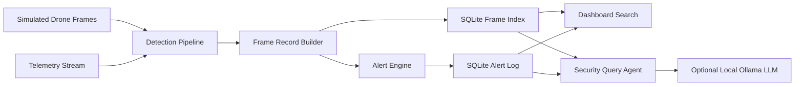

# Architecture

## Pipeline

## Components

- `DetectionPipeline`: Accepts a frame description and telemetry. It uses YOLOv8 when an image and model are available, otherwise it uses a deterministic simulator for repeatable tests.
- `SecurityDatabase`: Stores frames, detections, telemetry, captions, summaries, and alerts in SQLite. It includes FTS5 full-text search for frame-by-frame indexing.
- `AlertEngine`: Evaluates recent detections for loitering, intrusion, repeated vehicles, restricted-zone entry, and crowd detection.
- `VLMCaptionGenerator`: Produces human-readable frame captions. It can use an Anthropic API key when present and falls back to rule-based captions offline.
- `SecurityQueryAgent`: Answers follow-up questions from the indexed frame and alert history, such as "show all truck events" or "what alerts happened?" It always retrieves SQLite evidence first, then optionally asks local Ollama to produce a concise analyst-style answer.
- `FastAPI Dashboard`: Provides the web UI and JSON endpoints for stats, alerts, frames, search, summaries, and agent Q&A.

## Design Decisions

- SQLite is used because it is easy to run locally, supports indexes, and provides FTS5 for searchable frame history.
- Rules are explicit Python logic so alerts are explainable and testable.
- The simulator keeps the prototype deterministic for evaluation while leaving a YOLOv8 path for real image inference.
- The query agent is lightweight and database-backed to demonstrate follow-up Q&A without requiring cloud credentials. Local Ollama can improve phrasing and flexible natural-language answers while preserving the rule-based fallback.
